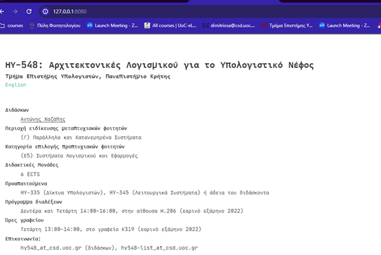

Assignment 1: Docker

# 1st

## A. Download the images tagged 1.23.3 and 1.23.3-alpine locally

docker pull nginx:1.23.3

docker pull nginx:1.23.3-alpine

## B. Compare the sizes of the two images

docker images nginx

This will return:

REPOSITORY TAG IMAGE ID CREATED SIZE

nginx 1.23.3 ac232364af84 11 months ago 142MB

nginx 1.23.3-alpine 2bc7edbc3cf2 12 months ago 40.7MB

## C. Start one of the two images in the background, with the appropriate network settings to forward port 80 locally and use a browser (or curl or wget) to see that calls are answered

docker run -d -p 80:80 nginx:1.23.3

This will run the nginx:1.23.3. Then in browser if we type <http://localhost> we will see the nginx welcome page, like this.

## D. Confirm that the container is running in Docker

With docker ps , we can see all the Docker containers that are running. It returns this:

C:\\Users\\user>docker ps

CONTAINER ID IMAGE COMMAND CREATED STATUS PORTS NAMES

1ff8432ce643 nginx:1.23.3 "/docker-entrypoint.…" 4 minutes ago Up 4 minutes 0.0.0.0:80->80/tcp zealous_meitner

## E. Get the logs of the running container

If we run the: docker logs 1ff8432ce643

(where 1ff8432ce643=CONTAINER ID), we will get these:

/docker-entrypoint.sh: /docker-entrypoint.d/ is not empty, will attempt to perform configuration

/docker-entrypoint.sh: Looking for shell scripts in /docker-entrypoint.d/

/docker-entrypoint.sh: Launching /docker-entrypoint.d/10-listen-on-ipv6-by-default.sh

10-listen-on-ipv6-by-default.sh: info: Getting the checksum of /etc/nginx/conf.d/default.conf

10-listen-on-ipv6-by-default.sh: info: Enabled listen on IPv6 in /etc/nginx/conf.d/default.conf

/docker-entrypoint.sh: Launching /docker-entrypoint.d/20-envsubst-on-templates.sh

/docker-entrypoint.sh: Launching /docker-entrypoint.d/30-tune-worker-processes.sh

/docker-entrypoint.sh: Configuration complete; ready for start up

2024/02/18 16:06:47 \[notice\] 1#1: using the "epoll" event method

2024/02/18 16:06:47 \[notice\] 1#1: nginx/1.23.3

2024/02/18 16:06:47 \[notice\] 1#1: built by gcc 10.2.1 20210110 (Debian 10.2.1-6)

2024/02/18 16:06:47 \[notice\] 1#1: OS: Linux 5.10.102.1-microsoft-standard-WSL2

2024/02/18 16:06:47 \[notice\] 1#1: getrlimit(RLIMIT_NOFILE): 1048576:1048576

2024/02/18 16:06:47 \[notice\] 1#1: start worker processes

2024/02/18 16:06:47 \[notice\] 1#1: start worker process 29

2024/02/18 16:06:47 \[notice\] 1#1: start worker process 30

2024/02/18 16:06:47 \[notice\] 1#1: start worker process 31

2024/02/18 16:06:47 \[notice\] 1#1: start worker process 32

2024/02/18 16:06:47 \[notice\] 1#1: start worker process 33

2024/02/18 16:06:47 \[notice\] 1#1: start worker process 34

2024/02/18 16:06:47 \[notice\] 1#1: start worker process 35

2024/02/18 16:06:47 \[notice\] 1#1: start worker process 36

172.17.0.1 - - \[18/Feb/2024:16:07:01 +0000\] "GET / HTTP/1.1" 200 615 "-" "Mozilla/5.0 (Windows NT 10.0; Win64; x64) AppleWebKit/537.36 (KHTML, like Gecko) Chrome/121.0.0.0 Safari/537.36" "-"

2024/02/18 16:07:02 \[error\] 29#29: \*1 open() "/usr/share/nginx/html/favicon.ico" failed (2: No such file or directory), client: 172.17.0.1, server: localhost, request: "GET /favicon.ico HTTP/1.1", host: "localhost", referrer: "<http://localhost/>"

172.17.0.1 - - \[18/Feb/2024:16:07:02 +0000\] "GET /favicon.ico HTTP/1.1" 404 555 "<http://localhost/>" "Mozilla/5.0 (Windows NT 10.0; Win64; x64) AppleWebKit/537.36 (KHTML, like Gecko) Chrome/121.0.0.0 Safari/537.36" "-"

## F. Stop the running container

With docker stop 1ff8432ce643 , we can stop the running container and we can confirm that with docker ps, like below.

## G. Start the stopped container

With docker start 1ff8432ce643 we can start the running container and we can confirm that with docker ps, like below.

## H. Stop the container and remove it from Docker

With docker stop 1ff8432ce643 && docker rm 1ff8432ce643 we stop and then remove the container. Then to confirm that is removed we can try to start it again, but we get:

# 2nd

## A. Open a shell session inside the running container and change the first sentence of the default page to "Welcome to MY nginx!". Close the session

Firstly we run

- C:\\Users\\user>docker run -d -p 80:80 nginx:1.23.3-alpine
- 76d8fd4964bd9869aab74bf8984082b3846f4209f67ef2219ace14f6999c8bd3

Then:

- C:\\Users\\user>docker ps
- CONTAINER ID IMAGE COMMAND CREATED STATUS PORTS NAMES
- 76d8fd4964bd nginx:1.23.3-alpine "/docker-entrypoint.…" 4 minutes ago Up 4 minutes 0.0.0.0:80->80/tcp jolly_shtern

And then

- C:\\Users\\user>docker exec -it jolly_shtern /bin/sh

(because /bash didn’t work)

Then to edit the html code we run

- vi /usr/share/nginx/html/index.html

inside the running container shell

Then we press I to edit the file and then ESC and :wq

Then with exit, we can close the shell session

## B. From your computer's terminal (outside the container) download the default page locally and upload another one in its place. Close the container, delete it and start another instance

For downloading the default page locally I used this command

- docker cp laughing_wilbur:/usr/share/nginx/html/index.html ./Desktop/intex.html

To upload another one in its place I used this one:

- docker cp ./Desktop/intex.html laughing_wilbur:/usr/share/nginx/html/index.html

Then I reloaded the localhost site and I saw the changes

Then I stopped and deleted the container, and then started a new one with these commands

- docker rm -f laughing_wilbur
- docker run -d -p 80:80 nginx:1.23.3-alpine

## C. Do you see the changes? Why

No I don’t see the changes I made in html (the one that I uploaded), because the changed html was copied inside the container's filesystem, so after removing the container, the changes where removed.

# 3

## The code that produces the course's website is available on GitHub (<https://github.com/chazapis/hy548>). Write down the commands needed to download the repository (and submodules) and hugo (the tool that builds the website), build the website locally, and start an Nginx container to serve the CS-548 website instead of the default page

download the repository (and submodules)

- git clone <https://github.com/chazapis/hy548.git>
- git submodule update --init --recursive

&nbsp;download hugo (Windows)

- choco install hugo-extended -confirm

build the website locally

- cd hy548/html
- hugo

start an Nginx container to serve the CS-548 website instead of the default page

- docker run -d -p 8080:80 -v C:\\git\\Socker_lab\\hy548\\html\\public:/usr/share/nginx/html nginx:1.23.3

After refreshing the page we see the hy548 page instead of the default

# 4

Following the previous exercise, create your own container image, based on Nginx, that will contain the CS-548 website instead of the default page. Downloading the CS-548 repository (and submodules), hugo and building the site should be done in the Dockerfile. Create a Docker Hub account and upload the image. Provide:

A. The Dockerfile.

To run the docker file I used:

docker build -t cs548-website -f DockerFile .

The docker file is this:

FROM nginx:1.23.3

\# Install git and Hugo

RUN apt-get update && \\

&nbsp;   apt-get install -y git && \\

&nbsp;   apt-get install -y hugo && \\

&nbsp;   rm -rf /var/lib/apt/lists/\*

\# Clone the repository and its submodules

RUN git clone --recurse-submodules <https://github.com/chazapis/hy548.git>

\# Build the website using Hugo

RUN cd hy548 && \\

&nbsp;   git submodule update --init --recursive && \\

&nbsp;   cd html && hugo -D

RUN cp -a hy548/html/public/. /usr/share/nginx/html/

EXPOSE 80

CMD \["nginx", "-g", "daemon off;"\]

B. The command needed to upload the image to Docker Hub.

docker login

docker tag cs548-website jimaandron/cs548-website

docker push jimaandron/cs548-website

Explain:

C. How much bigger is your own image than the image you were based on. Why;

Το δικό μου image είναι περίπου το διπλάσιο σε μέγεθος από αυτό του nginx. Αυτό διότι έχει κάποια έξτρα dependencies όπως το hugo και το cs548-website

D. What have you done in the Dockerfile to keep the image as small as possible?

Για να μειωθεί το μέγεθος του image το Dockerfile συνδυάζει τις εντολές εγκατάστασης όπου είναι δυνατόν και καθαρίζει τα περιττά αρχεία μετά την εγκατάσταση.

# 5

Upload the Dockerfile from the previous exercise to your GitHub repository. Create a GitHub Action that will automatically build and push the image to your Docker Hub account (the workflow should be initiated by the user). Provide the YAML of the workflow you made.

name: ci

on:

push:

branches:

\- "main"

jobs:

build:

runs-on: ubuntu-latest

steps:

\-

name: Checkout

uses: actions/checkout@v4

\-

name: Login to Docker Hub

uses: docker/login-action@v3

with:

username: ${{ secrets.DOCKERHUB_USERNAME }}

password: ${{ secrets.DOCKERHUB_TOKEN }}

\-

name: Set up Docker Buildx

uses: docker/setup-buildx-action@v3

\-

name: Build and push

uses: docker/build-push-action@v5

with:

context: .

file: ./DockerFile

push: true

tags: ${{ secrets.DOCKERHUB_USERNAME }}/cs548-website:latest
